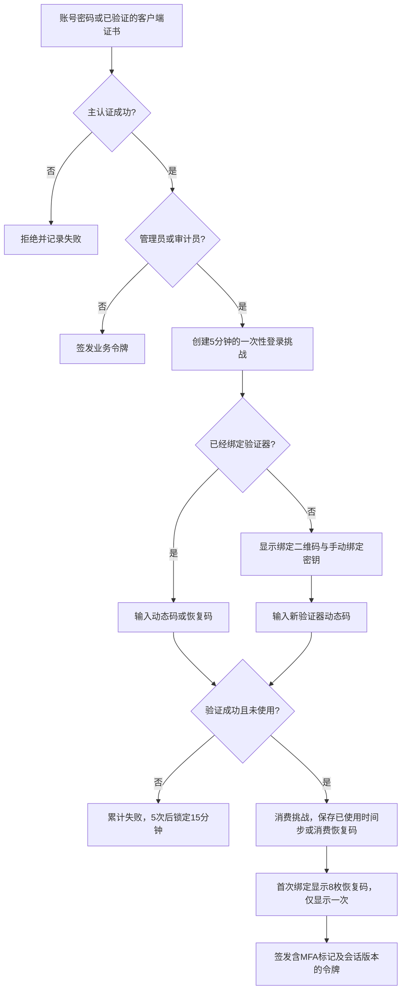

## TOTP 流程

```mermaid
flowchart TD
  A[账号密码或已验证的客户端证书] --> B{主认证成功?}
  B -->|否| X[拒绝并记录失败]
  B -->|是| C{管理员或审计员?}
  C -->|否| D[签发业务令牌]
  C -->|是| E[创建5分钟的一次性登录挑战]
  E --> F{已经绑定验证器?}
  F -->|否| G[显示绑定二维码与手动绑定密钥]
  F -->|是| H[输入动态码或恢复码]
  G --> I[输入新验证器动态码]
  H --> J{验证成功且未使用?}
  I --> J
  J -->|否| K[累计失败，5次后锁定15分钟]
  J -->|是| L[消费挑战，保存已使用时间步或消费恢复码]
  L --> M[首次绑定显示8枚恢复码，仅显示一次]
  M --> N[签发含MFA标记及会话版本的令牌]
```

