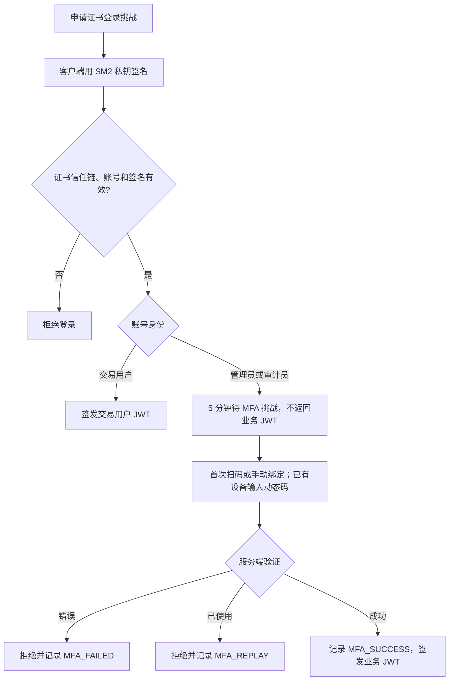

# 第2周课堂实践与演示

本实践按二手交易平台设计，业务身份只有交易用户、管理员、审计员。交易用户既能买也能卖，因此不照搬课堂样例中买家和商户互斥的权限。原有能力已覆盖大部分要求，本次补充统一权限判断函数、指定 MFA 审计事件和真实证书签名串联 TOTP 的可重复测试证据。

## 要求对照

| 课堂要求 | 本项目实现与证据 |
| --- | --- |
| 角色及权限矩阵 | normal 为交易用户，admin 为管理员，auditor 为审计员；页面只显示三行 |
| 统一权限函数或装饰器 | security_core.has_permission；中间件用于审计和商品操作；ProtectedView 支持 required_permission |
| 越权返回 403 | 交易用户访问全平台管理或审计被拒绝，审计员不能创建订单或管理发布 |
| 自己的数据允许、他人数据拒绝 | 商品 seller_id、订单 user_id 校验；自己的商品工作台允许进入 |
| 证书后接 TOTP | /auth/cert/challenge → SM2 私钥签名 → /auth/cert/login → 待 MFA → /auth/mfa/verify → JWT |
| 正确、错误、重复验证码 | 独立测试记录覆盖成功、错误、已消费挑战及新挑战重复旧动态码 |
| 指定审计事件 | MFA_SUCCESS、MFA_FAILED、MFA_REPLAY，保留原 auth.mfa.* 事件便于追溯 |
| 恢复码加分项 | 已实现 8 枚恢复码，超过课堂建议的 3～5 枚；每枚只允许使用一次 |
| 提交证据 | evidence/week2/results.json、test-records.md、role-matrix.png、mfa-audit.png |

这是课堂最小可运行版本，没有新增角色表、权限关联表或第四种业务身份。历史 merchant 值继续兼容交易用户，不单独在角色矩阵中展示。原有密码 + TOTP 入口保留；课堂规定的证书 + TOTP 路径由本次证书签名测试单独验证。

## 权限矩阵与设计理由

| 操作 | 交易用户 | 管理员 | 审计员 |
| --- | --- | --- | --- |
| 浏览商品 | 允许 | 允许 | 允许 |
| 购物车、购买、自己的订单 | 允许 | 允许，仅本人购买数据 | 拒绝 |
| 发布、编辑商品 | 允许，仅自己的商品 | 允许，全平台 | 拒绝 |
| 用户、分类、全平台订单管理 | 拒绝 | 允许 | 拒绝 |
| 审计查看、导出 | 拒绝 | 允许 | 允许 |
| TOTP 绑定、换绑 | 不强制 | 强制 | 强制 |

交易用户具备买卖双方能力，但不能修改他人发布。管理员维护平台秩序，因此具有全平台管理权限。审计员负责检查行为记录，不参与交易或修改业务数据。管理员具备审计查看能力，便于处理安全事件，这与课堂示例中仅商户经营的后台不同。

原课堂的“普通用户不能进入商户后台”对应本平台的“交易用户不能进入全平台管理后台”，不能用它禁止交易用户进入自己的“我的发布”。

## TOTP 流程图与实现



TOTP 使用共享密钥、SHA-1、6 位验证码、30 秒时间步，允许前后各一个时间步偏差。服务端保存已消费的最大时间步，拒绝该步及更早的动态码；这样截获成功登录请求的人不能重复使用它。仍在窗口内的旧码可以明确识别为 MFA_REPLAY；超出有效窗口的码按无效验证码处理。

登录挑战验证成功后保留到期前的已消费标记，清除待绑定密钥，再次提交同一挑战会被拒绝并留下 MFA_REPLAY。新登录会替换旧挑战；未知或已过期挑战不能冒充某用户写入成功记录。恢复码仅保存哈希，消费后从可用集合删除。

## 最快演示方法

在项目根目录运行：

```powershell
conda activate WAF
python scripts/week2_classroom.py
```

正常结束显示 `PASS: 28 checks`，生成 `docs/evidence/week2/results.json`。这是实际 Django 接口处理链、临时 SQLite 数据库和临时 SM2 CA 的集成测试，证书及签名真实生成与验证，没有模拟“证书验证通过”。它不是经 nginx 的浏览器 mTLS 网络测试；测试客户端在进程内调用 API。

测试材料只包含接口、预期/实际状态码和脱敏审计记录，不输出私钥、绑定密钥、恢复码或登录令牌。测试不连接正式 MySQL，不替换项目 CA 或已绑定验证器；测试初始化禁用了无关的业务密钥文件生成。

向老师依次展示以下记录即可：

1. `trader denied platform management`：交易用户访问 `/api/admin/users`，403。
2. `trader denied audit`：交易用户访问 `/api/audit/events`，403。
3. `auditor audit allowed`：审计员查看审计，200。
4. `trader own order allowed`：交易用户查看自己的订单，200。
5. `certificate alone issues no privileged JWT`：证书通过后仍无管理员/审计员业务令牌。
6. `correct MFA allows login`：正确动态码成功；`incorrect MFA denied`：错误动态码返回 400。
7. `old TOTP in new challenge denied`、`consumed challenge replay denied`：两种重复使用均拒绝。
8. `one-time recovery allows login`、`used recovery rejected`：恢复码只能使用一次。

## 实际页面演示及截图

若要用浏览器查看本次测试留下的审计事件，改为运行：

```powershell
python scripts/week2_classroom.py --serve
```

这个命令先重新运行上述证书和权限测试，再启动隔离演示站。保持终端打开，访问 `http://127.0.0.1:8766/login`。

1. 使用管理员 `user3`，密码 `TestPass123!`。每次重新启动此命令，该账号都尚未绑定。
2. 用验证器扫码绑定，输入六位动态码，保存恢复码并进入后台。这一步用于登录截图页面；证书串联流程已由前面的测试验证。
3. 点击“角色权限”，展示只有交易用户、管理员、审计员三行的矩阵。
4. 点击“日志与安全事件”，展示 `user4` 的 MFA_SUCCESS、MFA_FAILED、MFA_REPLAY。user4 是脚本通过证书登录的审计员。
5. 可导出审计报告。截图完成后在终端按 Ctrl+C，临时演示环境停止；下次启动重新生成数据。

页面截图：


本次也提供自动截图脚本 `scripts/capture_week2.cjs`，需要 Playwright 和 Chromium/Chrome，运行前应启动一个新的 `week2_classroom.py --serve`。它会完成演示管理员的首次绑定，因此不要与手动首次绑定同时运行。

## 在自己的 MySQL 项目中演示

重启后端，沿用前端开发启动方式。`week1_admin`、`week1_auditor`、`week1_buyer` 等已有演示账号及其绑定保持不变，新建时密码为 `Week1Demo123!`，如已修改则使用自己的密码。

用不同浏览器窗口登录不同身份：交易用户显示“我的发布”，管理员显示控制台全平台管理，审计员只见审计与账号安全。注意仅菜单隐藏不能证明接口安全，应结合上面的 403 接口证据。

已绑定账号可先提交错误动态码，再提交正确动态码；短时间内再次登录并提交刚用过的动态码，会被拒绝并记录 MFA_REPLAY。操作间隔过长导致旧码离开容许时间窗口时，只能证明验证码过期，此时应以自动脚本的重复使用测试为准。不要连续错输 5 次，否则会进入 15 分钟锁定。

后续已完成 Windows → WSL nginx 的真实 mTLS 证书登录联调。浏览器导入证书、网关配置与不使用脚本的课堂操作，见同目录《证书登录与手动课堂演示.md》。本篇自动化测试仍用于原 SM2 签名接口证据。

## 修改的核心文件

- `api_service/api/security_core.py`：统一权限判断、动态码重放识别。
- `api_service/api/middleware.py`：商品操作、审计接口调用权限函数。
- `api_service/api/admin_views.py`：MFA 指定事件、已消费挑战、权限检查入口。
- `api_service/tests/test_course_security.py`：隔离测试时不生成业务密钥文件。
- `scripts/week2_classroom.py`：课堂证书认证、权限、TOTP、恢复码与审计证据。
- `scripts/capture_week2.cjs`：实际页面的权限矩阵及审计截图。

无需新增数据库字段。原有单角色字段、共享权限字典、安全状态与审计表继续使用。正式部署的多进程证书挑战存储、CRL 吊销检查及数据库管理员级别的日志防篡改不在本次最小课堂实现范围内。
