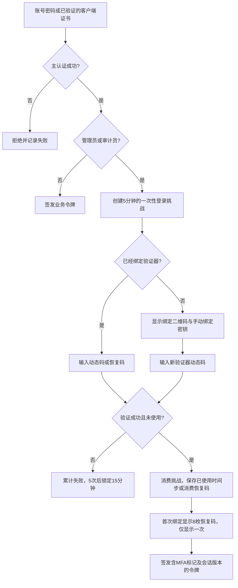

# 第一周任务：RBAC、TOTP 与管理后台

二手交易平台调整：normal 用户同时具有买家与卖家能力，无需开通商户身份；可购买商品，也可通过商品页或顶部“我的发布”维护自己的商品。管理员管理全平台，审计员保持只读审计职责。旧 merchant 账号与 normal 具有相同交易权限，保留原账号和商品归属；管理页面不再提供单独分配 merchant 的选项。兼容接口 /api/merchant/products 继续用于查询和管理本人发布。新建演示卖家使用 normal 角色，已有账号不会被初始化脚本改写。

本次按用户最新要求，只完成课件开头的 RBAC 与 MFA 阶段。课件第 43–45 页将该阶段的提交与验收节点标为“第 2 周”；本文按用户所称的“第一周任务”组织。第 4 周的应用层国密信封、第 7 周扫描、第 9 周压测和第 12 周综合交付不在本次范围内。

## 启动与演示账号

沿用现有 MySQL、电商 API、Vue 与模拟银行的运行方式。先在项目根目录激活原后端环境（本机为 `conda activate WAF`），执行：

```powershell
python scripts/setup_security.py
python api_service/manage.py init_security
python api_service/manage.py seed_week1 --demo
python api_service/manage.py runserver 127.0.0.1:8080
```

另开终端运行：

```powershell
cd frontend
npm ci
npm run dev
```

访问 `http://localhost:3000/login`。 使用已有 HTTPS 网关时继续通过该网关访问，TOTP 绑定密钥和登录凭据应通过 HTTPS 传输。本次没有加入应用层国密加密。

| 账号 | 角色 | 首次登录 |
| --- | --- | --- |
| week1_admin | 管理员 | 密码后绑定 TOTP |
| week1_auditor | 审计员 | 密码后绑定 TOTP |
| week1_merchant | 交易用户 | 密码登录 |
| week1_merchant2 | 第二个交易用户，用于交叉越权测试 | 密码登录 |
| week1_buyer | 交易用户 | 密码登录 |

使用 `--demo` 创建的新账号密码为 `Week1Demo123!`，仅供本地验收。命令重复执行不会修改既有账号的密码或角色。不使用 `--demo` 时命令交互读取自选密码。演示商品 SKU 为 `WEEK1-DEMO-1`、`WEEK1-DEMO-2`，分别属于两个交易用户。初始化不会预先绑定验证器。

管理员与审计员登录后进入 `/dashboard`。管理员页面提供真实数据库统计、用户角色与停用管理、商品新增/编辑/上下架、分类管理、已付款订单发货、审计查询/导出、权限矩阵、验证器更换。交易用户工作台只显示自己的商品。审计员工作台只显示日志、权限说明和自己的验证器设置。

`MFA_ENCRYPTION_KEY` 由初始化脚本生成，用于加密数据库中的 TOTP 密钥，不可随意更换，否则已绑定的密钥将无法解密。脚本保留已有 MFA 密钥；缺失或少于 32 字符的 JWT 密钥会替换为随机密钥，需要重启后端并重新登录。

## 权限矩阵

| 接口 / 资源 / 操作 | 交易用户 | 交易用户 | 管理员 | 审计员 |
| --- | --- | --- | --- | --- |
| GET /api/products、/api/categories | 允许 | 允许 | 允许 | 允许 |
| 自己的资料查询 | 允许 | 允许 | 允许 | 允许 |
| 已登录修改自己的密码 | 允许 | 允许 | 允许 | 允许 |
| 资料修改、购物车、订单查询、下单、支付 | 仅本人资源 | 仅本人资源 | 仅本人购物资源 | 拒绝 |
| POST /api/products | 允许，归属自己 | 允许，归属自己 | 允许 | 拒绝 |
| PUT/DELETE /api/products/{id} | 仅自己的商品 | 仅自己的商品 | 允许 | 拒绝 |
| GET/POST/PUT /api/merchant/products[/id] | 拒绝 | 仅自己的商品 | 允许 | 拒绝 |
| GET /api/admin/overview | 拒绝 | 拒绝 | 允许 | 拒绝 |
| GET/PATCH /api/admin/users[/id] | 拒绝 | 拒绝 | 允许 | 拒绝 |
| /api/admin/products、/api/admin/categories | 拒绝 | 拒绝 | 允许 | 拒绝 |
| GET /api/admin/orders、POST /api/admin/orders/{id}/ship | 拒绝 | 拒绝 | 允许 | 拒绝 |
| GET /api/audit/events、/api/audit/export | 拒绝 | 拒绝 | 允许 | 允许 |
| GET /api/audit/permissions | 拒绝 | 拒绝 | 允许 | 允许 |
| POST /api/auth/mfa/rebind | 拒绝 | 拒绝 | 仅自己的验证器 | 仅自己的验证器 |

用户角色来自数据库 `users.user_role`，不信任浏览器传入的角色。角色集合和权限声明集中在 `api_service/api/security_core.py`；中间件执行接口与操作控制，商品、订单接口继续执行资源归属校验。采用单用户单角色的 RBAC 实现，不提供任意编辑权限矩阵的接口。

管理员不能修改自己的角色或停用自己的账号。修改其他用户权限或状态后递增其会话版本，旧令牌立即失效。多个管理员同时变更权限时按顺序锁定管理员记录，并重新确认操作者仍有权限。

## RBAC / MFA 数据库设计

| 表 | 关键字段与用途 |
| --- | --- |
| users | 已有 user_id、user_role、is_active；角色值 normal/admin/auditor；merchant 兼容历史交易账号 |
| products | 已有 seller_id，用于交易用户归属控制 |
| orders | 已有 user_id，用于用户订单归属控制 |
| security_states | user_id 主键；加密 secret、enabled、last_step、恢复码哈希列表、失败次数、锁定期限、会话 version |
| login_challenges | 随机挑战的哈希主键、user_id、过期时间、会话版本、尚待确认的加密绑定密钥 |
| audit_events | 事件 ID、操作者 ID/用户名/角色、操作、资源、结果、来源 IP、UTC 时间；不存密码、令牌、TOTP 密钥或完整请求体 |

安全状态以数据库事务和行锁更新，MySQL 多进程服务共享 MFA 锁定、恢复码使用状态和会话版本。自动化测试使用隔离的 SQLite 内存数据库。本机 MySQL 已完成新增安全表初始化及第一周演示账号/商品创建，未改写既有账号；MySQL 并发锁行为仍需要专项复核。

## TOTP 流程



使用 SHA-1 TOTP、六位动态码、30 秒时间步，允许前后各一个时间步偏差。数据库记录已消费的最大时间步，同一动态码无法重复使用；向前偏差的时间步一旦消费，同一步及更早时间步都会拒绝。

恢复码为随机生成的 20 位十六进制字符串，数据库只保存 SHA-256 哈希，每枚一次性消费。设备遗失后可用恢复码登录，在“账号安全”中用另一枚恢复码开始换绑，再验证新设备动态码；成功后旧密钥、旧恢复码失效。换绑开始时旧会话失效，未完成换绑时仍保留原验证器以便重新登录。

现有演示短信验证码不能用于重置管理员或审计员密码，防止通过旧找回密码流程抢先绑定验证器。特权用户应登录后在个人中心修改密码；密码和全部恢复因素同时丢失时，需要运维人工核验身份，本阶段不提供公开的免验证恢复入口。

首次绑定前不会向前端签发可用的管理员或审计员业务令牌。未带 MFA 标志的旧特权令牌不能访问业务接口。密码登录和支持的证书登录入口使用同一 MFA 后置验证流程。

证书文件本身是公开材料，已禁止仅上传公钥证书就签发登录令牌。浏览器 mTLS 登录必须由网关验证客户端证书，并覆盖传给后端的 `X-SSL-CLIENT-VERIFY`、`X-SSL-CLIENT-CERT`、`X-SSL-CLIENT-S-DN`、`X-MTLS-PROXY-SECRET`。后者必须与 `.env` 的 `MTLS_PROXY_SECRET` 一致。后端只监听本机或网关专用网络；不得把该代理密钥放入前端。原 nginx 示例需补充 `proxy_set_header X-MTLS-PROXY-SECRET "配置的代理密钥";` 后再使用证书登录。密码登录不受此配置影响。

## 审计事件字典

| 事件 | 触发条件 |
| --- | --- |
| auth.login / auth.login.failed | 普通登录成功 / 主认证失败 |
| auth.mfa.challenge | 为特权用户创建登录挑战 |
| auth.mfa.enroll / auth.mfa.verify / auth.mfa.failed | 绑定、二因素验证成功或失败 |
| auth.mfa.rebind.start / auth.mfa.rebind.denied | 开始换绑 / 换绑验证拒绝 |
| auth.denied / auth.session.revoked | 无效认证或过期的会话版本、缺少 MFA |
| rbac.denied | 角色缺少访问接口或执行操作的权限 |
| users.update | 管理员修改用户权限、账号状态 |
| products.create / products.update | 管理商品创建、修改、上下架 |
| categories.update | 分类创建或修改 |
| orders.ship | 已付款订单发货 |
| audit.read / audit.export | 查看审计记录或导出报告，包含审计员自己的操作 |
| HTTP 方法 + API 路径 | 已认证写操作和资源越权拒绝的统一补充记录 |

审计接口支持分页、角色/事件/结果/日期/资源筛选。前端提供资源、结果、起始日期筛选；导出同一筛选范围最近至多 10000 条 JSON 记录。应用没有编辑或删除审计记录的接口。此版本未实施数据库管理员级别的日志防篡改存储。

## 验收步骤

1. 以交易用户登录，直接请求 `/api/admin/users`，应返回 403；修改本地存储中的 role 不能改变后端结果。
2. 以两个交易用户分别登录。交易用户 A 查看工作台只见自己的商品；调用 PUT `/api/merchant/products/{交易用户B商品ID}` 应返回 403，商品保持原值。
3. 用用户 B 的令牌访问用户 A 的 `/api/orders/{id}`，应返回 403；所有者访问成功。
4. 管理员、审计员分别首次登录，均先显示绑定界面；绑定成功后保存恢复码。注销后再登录须输入动态码或恢复码。
5. 重复提交已成功使用的登录挑战，必须拒绝；同一动态码用于新的登录挑战也必须拒绝。恢复码用过后不能再次登录。
6. 连续提交 5 次错误动态码，后续验证返回 429；即使重新输入正确账号密码，也不能清除 15 分钟锁定。
7. 调整验证器时间到容许范围，验证偏差处理；超出时间窗口的动态码拒绝。
8. 以审计员登录，只能查日志与导出报告、管理自己的验证器，用户/商品/订单/支付接口拒绝。
9. 管理员修改某用户角色、停用账号、编辑商品或发货；审计页面应显示操作者、时间、资源与结果。停用账号或变更角色后的旧令牌失效。
10. 审计员查看或导出日志，再刷新日志，应看到其自身的 audit.read / audit.export 记录。

运行自动化回归：

```powershell
python -m unittest api_service.tests.test_course_security -v
cd frontend
npm test -- --runInBand --coverage=false
npm run build
```

测试范围和实测结果见同目录 `evidence/first-week-results.txt`、`evidence/browser-results.json` 和 `evidence/第一周验证结果.md`。浏览器自动化脚本为 `scripts/check_admin_ui.cjs`，已使用本机 Chrome 检查登录绑定、用户权限修改、商品新增、订单发货和审计导出，并保存桌面与移动端截图。脚本默认使用 Playwright Chromium，也可通过 `CHROME_EXECUTABLE` 指定 Chrome 路径，通过 `PLAYWRIGHT_MODULE` 指定已安装的 Playwright 模块。

如需不连接 MySQL 的临时界面预览，可先完成前端构建，再运行 `python scripts/preview_course.py`，访问 `http://127.0.0.1:8765/login`。这是独立的内存数据库：user3 为管理员、user4 为审计员，密码均为 `TestPass123!`。停止进程后数据消失；预览不包含模拟银行支付联调，不用于正式部署。

首次绑定与账号安全中的验证器换绑均支持扫码：二维码在浏览器本地生成，不向第三方发送密钥。扫描后仍需输入六位动态码确认；手动密钥输入继续可用。
