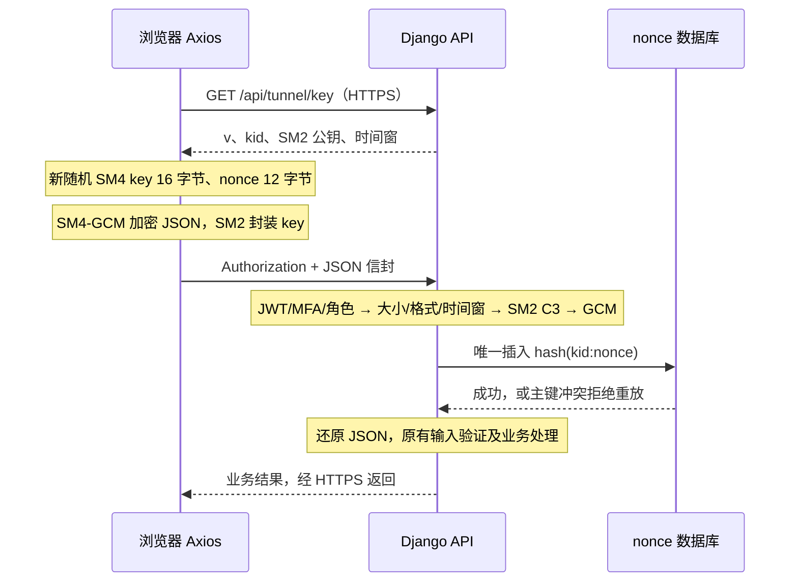

# 第 4 周应用层安全通道 v1

## 目标和范围

二手交易平台仍只有交易用户 normal、管理员 admin、审计员 auditor 三种业务身份；历史 merchant 是交易用户兼容值。身份认证和权限检查先于通道解密。

范围：`POST /api/tunnel/demo` 模拟收件信息，以及已有的 `POST /api/users/bank-card` 银行卡绑定。两个接口必须使用信封，不接受明文降级；其他接口维持现有协议。演示接口不保存地址、不创建订单。当前不是整个系统所有请求或响应的加密改造，响应和其他接口继续依赖 HTTPS。银行卡原有存储、响应字段没有因通道改造而变为数据库加密。

正常使用经过 WSL nginx 的 HTTPS 8443 入口，公钥也通过此可信通道获得。应用层信封不能代替 HTTPS、浏览器证书校验、JWT、MFA 或资源归属检查。

## 请求处理



信封的字段集合必须严格一致，十六进制使用小写、不带 0x：

| 字段          | 类型/长度       | 含义                                                 |
| ------------- | --------------- | ---------------------------------------------------- |
| v             | 整数 1          | 版本，不接受字符串或布尔值                           |
| kid           | 16 个 hex 字符  | 服务端公钥 SHA-256 前 16 个 hex 字符（不含 04 前缀） |
| ts            | 整数 Unix 秒    | 与服务端相差不超过 120 秒                            |
| nonce         | 24 个 hex 字符  | 96 位随机 GCM IV，同时用于重放检查                   |
| encrypted_key | 224 个 hex 字符 | SM2 C1C3C2：C1=64 字节坐标，不含 04；C3=32；C2=16    |
| ciphertext    | 偶数个 hex 字符 | 原始 JSON UTF-8 密文，明文上限 32 KiB                |
| tag           | 32 个 hex 字符  | 128 位 GCM 认证标签，不截断                          |

AAD（附加认证数据）为以下七个字符串用单个 LF 换行拼接，再 UTF-8 编码，末尾无换行：

```text
1
kid
大写 HTTP 方法
完整路径（例如 /api/tunnel/demo，不含查询串）
十进制 ts
nonce 的小写 hex
SHA-256(完整 Authorization 字符串的 UTF-8) 的小写 hex
```

受保护接口不使用查询串决定业务数据。绑定方法、路径及当前 JWT，能拒绝把同一个密文换到另一路由或另一账号下执行。身份有效性仍由 JWT 中间件决定；SM2 公钥加密本身不是客户端签名，GCM 标签也不提供用户不可否认性。

## 密钥生命周期

- 长期 SM2：初始化脚本用 secrets 生成曲线范围内私钥；独立于证书 CA、支付密钥。`keys/tunnel/server.json` 中只有公钥、kid 和 Fernet 加密后的私钥。
- 包裹密钥：`TUNNEL_KEY_ENCRYPTION_KEY` 写入项目 `.env`；两个文件均被 Git 忽略。此为本机 Demo 的文件保护，若机器及 `.env` 一并泄露，私钥仍会暴露；部署时应由密钥服务或环境注入，并限制文件访问权限。
- 短期 SM4：每次提交由浏览器 CSPRNG 重新产生 16 字节随机 key，仅保留在内存；完成封装后清零可控数组，不落盘、不写日志。JS 运行时/库产生的内部副本无法保证全部擦除。
- nonce：每次重新生成 12 字节随机值。数据库表 `tunnel_nonces` 保存 SHA-256(kid:nonce) 主键及 expires_at 索引，不保存正文。插入在验证之后、业务之前；并发请求靠唯一约束拒绝，服务重启不清空正式 MySQL 防重放状态。
- 清理：请求验证通过后删除过期项，保留至 ts+121 秒。业务失败也已经消费 nonce，再次提交应通过浏览器产生新信封。不是支付业务幂等机制。
- 初始化重复运行不覆盖密钥。更换机器需同时安全迁移加密私钥和包裹密钥；缺失时拒绝请求，不临时生成新私钥。
- 轮换：暂停敏感写请求，备份现有两个密钥材料，指定新的 `TUNNEL_KEY_FILE` 和新的包裹密钥并初始化；重启后端。v1 只接受当前 kid，没有双密钥过渡期；浏览器每次请求重新取公钥，不自动重试业务。旧请求收到 KEY_CHANGED 后人工重新提交。

## 验证与错误

| HTTP      | 结果                                    | 说明                               |
| --------- | --------------------------------------- | ---------------------------------- |
| 200       | 业务成功                                | 通道通过后还必须满足业务字段校验   |
| 400       | TUNNEL_REQUIRED / INVALID / KEY_CHANGED | 明文、格式错误、篡改或旧密钥       |
| 401 / 403 | 认证/权限拒绝                           | 无登录、未完成 MFA 或角色无权限    |
| 408       | TUNNEL_EXPIRED                          | 时间窗失效（包括过大的未来时间）   |
| 409       | TUNNEL_REPLAY                           | 完整信封重复执行                   |
| 413       | TUNNEL_TOO_LARGE                        | 大小超限                           |
| 503       | 通道不可用                              | 密钥或防重放存储不可用，不降级放行 |

时间检查早于密码验证，因此修改 ts 为很旧的值会先返回 408；要证明真正过期，可保留完整未修改请求等待 125 秒后提交。修改有效时间窗内的 ts 则因 AAD 不匹配返回 400。全局中间件可能将 5xx 的响应体统一为通用服务错误，HTTP 状态仍为 503。

## 库与验证依据

前端锁定 sm-crypto-v2 1.15.0。后端使用已有 cryptography 45.0.5 的 SM4，配合 PyCryptodome 3.21.0 GCM 引擎，不自行编写 GHASH。因为本机 OpenSSL 不直接支持 SM4-GCM，使用了小型 block-cipher 适配器；`Crypto.Cipher._mode_gcm` 是私有 API，升级依赖前必须重新执行标准向量及互通测试。该实现是课程 Demo，不代表取得商用密码产品认证。

gmssl 3.2.2 的 decrypt 未验证 SM2 C3，本次额外校验 C1 曲线点、C3 常量时间摘要比较和 key 长度，随后才调用 GCM。GCM 必须先完成 decrypt_and_verify 才会把正文传给业务视图。

标准向量依据 [RFC 8998 Appendix A.1](https://www.rfc-editor.org/rfc/rfc8998.html#appendix-A.1)，前端 API 依据 [sm-crypto-v2 官方仓库](https://github.com/Cubelrti/sm-crypto-v2)。测试覆盖标准向量、Node/浏览器与 Python 互通、密文/标签/C3/nonce/时间戳篡改、角色及账号绑定、跨路径、重放、过期、大小限制、配置缺失及真实银行卡接口。